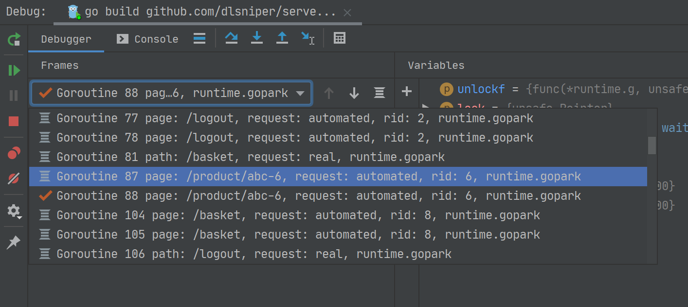

# Debugger Middleware

This package provides a debugging middleware for Go applications to enable
better display of goroutines in the debugger.

It has nearly-zero performance penalty in production code when not actively used.

## How this looks like in the IDE

Below you can see how this feature looks like in GoLand IDE:



## How to use

Include it in your application using one of the patterns below.

Then, compile the application with `-tags debugger`, e.g.

```shell script
go build -tags debugger
```

More details on how to use this can be found in this blog post:
https://blog.jetbrains.com/go/2020/03/03/how-to-find-goroutines-during-debugging/

### HTTP handlers

In your code, replace the HTTP handler with the `Middleware` function call.

Original:
```go
router.HandleFunc("/", homeHandler)
```

Replacement:
```go
router.HandleFunc("/", debugger.Middleware(homeHandler, func(r *http.Request) []string {
    return []string{
        "path", r.RequestURI,
    }
}))
``` 

### Non-HTTP handlers

For normal functions/methods, you can use the `SetLabels` / `SetLabelsCtx` functions
to set the debugger labels. 

Original:
```go
func sum(a, b int) int {
    return a+b
}
```

Replacement:
```go
func sum(a, b int) int {
    debugger.SetLabels(func() []string {
        return []string{
            "a", strconv.Itoa(a),
            "b", strconv.Itoa(b),
        }
    })

    return a+b
}
```

## Performance

You can asses the performance of this library by running the included benchmarks
in your environment.

Here are the results from my own machine (Intel Core i7 6700HQ, 32GB RAM, Windows 10),
when running with a `-count=5` pass, averaged across runs.

Go 1.13.8

Without labels:
<table>
    <thead>
        <tr>
            <th rowspan="2">Name</th>
            <th colspan="2">go 1.13.8</th>
            <th colspan="2">go 1.14 RC1</th>
        </tr>
        <tr>
            <th>Execution count</th>
            <th>Time</th>
            <th>Execution count</th>
            <th>Time</th>
        </tr>
    </thead>
    <tbody>
        <tr>
            <td>BenchmarkWorkerWithout-8</td>
            <td>3255558</td>
            <td>370 ns/op</td>
            <td>3183910</td>
            <td>368 ns/op</td>
        </tr>
        <tr>
            <td>BenchmarkWorkerWithOne-8</td>
            <td>25938</td>
            <td>45698 ns/op</td>
            <td>25643</td>
            <td>46479 ns/op</td>
        </tr>
        <tr>
            <td>BenchmarkWorkerWithThree-8</td>
            <td>15656</td>
            <td>78222 ns/op</td>
            <td>19754</td>
            <td>60131 ns/op</td>
        </tr>
        <tr>
            <td>BenchmarkWorkerWithTen-8</td>
            <td>5776</td>
            <td>216798 ns/op</td>
            <td>7322</td>
            <td>171842 ns/op</td>
        </tr>
        <tr>
            <td>BenchmarkWorkerWithConv-8</td>
            <td>15374</td>
            <td>79609 ns/op</td>
            <td>19049</td>
            <td>63818 ns/op</td>
        </tr>
    </tbody>
</table>

## License

This project is provided under the [MIT license](LICENSE).